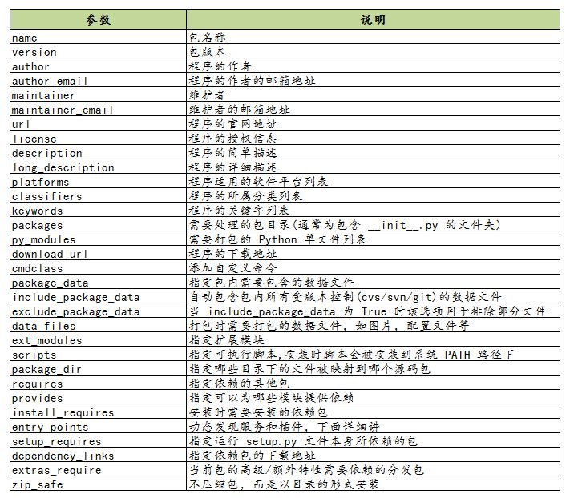

# 自定义包的打包与发布

[参考连接](https://zhuanlan.zhihu.com/p/276461821?utm_source=wechat_timeline)


## 包的分发
   
   1. 源码包的形式
       - 解压，编译，安装； 
       - 跨平台，安装速度慢
   2. 二进制包的形式
        - 没有编译过程，直接解压安装，速度快
        - 常见格式： egg(.egg)、 wheel(.whl)
       
   3. setup.py 简单的使用示例
        ```python
        from setuptools import setup, find_packages

        setup(
            name="mytest",
            version="1.0",
            author="wangbm",
            author_email="wongbingming@163.com",
            description="Learn to Pack Python Module",
        
            # 项目主页
            url="https://github.com/doosea", 
        
            # 你要安装的包，通过 setuptools.find_packages 找到当前目录下有哪些包
            packages=find_packages()
        )
        ```
   4. setup.py 的多个参数
        1.  包的分类信息: `classifiers`
        2.  关于文件的分发： 
             - 方式1: 
                1. `data_files`: 安装过程中，需要安装的静态文件，如配置文件、service文件、图片等
                2. `package_data`: 希望被打包的文件
                3. `exclude_package_data`: 不打包某些文件
            - 方式2:　`MANIFEST.in` 文件
                1. 需要放在和 `setup.py` 同级的顶级目录下，`setuptools` 会自动读取该文件
  
        3. 关于依赖包的下载安装: `install_requires`
        4. 关于安装环境的限制： `python_requires`
        
   5. 使用setup.py 构建包
        1. 构建源码发布包
            - `python setup.py sdist`  
        2. 构建二进制发布包
            - `python setup.py bdist_wininst`: windows 下的exe 二进制软件包
            - `python setup.py bdist_rpm` : linux 中rpm 包
            - `python setup.py bdist_egg` : egg 包
            - `python setup.py bdist_wheel` : whl 包
   6. 使用setup.py 安装包
        - `python setup.py install`: 它会将你的模块安装至系统全局环境中
        - `python setup.py develop`:  该方法不会真正的安装包，而是在系统环境中创建一个软链接指向包实际所在目录。这边在修改包之后不用再安装就能生效，便于调试        
                
   

## 自定义 wheel 的包的具体示例
1. 文件目录结构

        .
        ├── my_package
        │   └── __init__.py
        └── setup.py

2. setup.py 中的内容
    ```python
    from setuptools import setup, find_packages
    
    setup(
            name='my_package',     # 包名字
            version='1.0',   # 包版本
            description='',   # 简单描述
            author='dosea',  # 作者
            author_email='doosea@163.com',  # 作者邮箱
            url='https://github.com/doosea/mypackage.git',      # 包的主页
            packages=find_packages()                # 包
    )  

    ```

3. __init__.py 
    ```python
    def china():
        print("China NO.1")
    
    
    def my_package():
       print("this is my_package!")
    
    
    if __name__ == '__main__':
        my_package()
        china()
    ```

4. 制作 wheel 文件

    `python setup.py bdist_wheel`

5. 打包编译后的文件目录结构

        .
        ├── build
        │   ├── bdist.linux-x86_64
        │   └── lib
        │       └── my_package
        │           └── __init__.py
        ├── dist
        │   └── my_package-1.0-py3-none-any.whl
        ├── my_package
        │   └── __init__.py
        ├── my_package.egg-info
        │   ├── dependency_links.txt
        │   ├── PKG-INFO
        │   ├── SOURCES.txt
        │   └── top_level.txt
        └── setup.py
        
6. 使用.whl 文件安装依赖库
    
    `pip install my_package-1.0-py3-none-any.whl`
    
7. 使用自定义的包
    
   ```python
    import my_package
    my_package.china()
    my_package.my_package()
   ``` 
